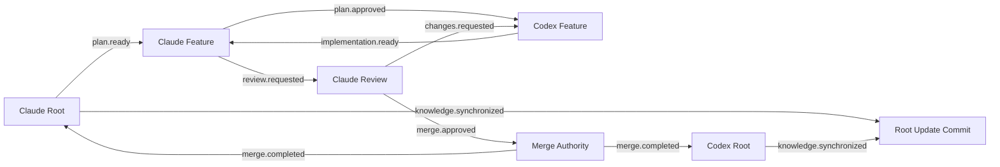
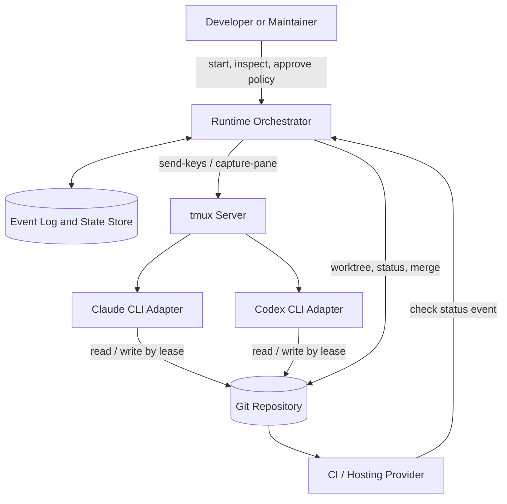

# AI Multi-Agent Runtime

## 1. Vision

AI Multi-Agent Runtime is a local-first execution environment for long-running
AI coding agents. It preserves useful project context without treating any
model conversation as durable state. Claude CLI and Codex CLI run continuously
in separate `tmux` sessions. Their collaboration is represented as explicit
events, review decisions, Git commits, and root-session knowledge updates.

The runtime is designed for repositories where a sequence of small and medium
changes should retain architectural continuity, yet feature-level reasoning
should not contaminate the project-wide context indefinitely. The design
separates those concerns by assigning one root session per AI and one
short-lived forked session per feature.

The operative principle is simple:

> Git records reality. Agent sessions only cache an interpretation of reality.

This distinction permits aggressive session disposal, reliable crash recovery,
and an implementation that does not rely on a proprietary session identifier
or a vendor-specific resume capability.

## 2. Problem statement

Long-running AI-assisted development has four recurring failure modes.

| Problem | Consequence without this runtime | Design response |
| --- | --- | --- |
| Context inflation | A single chat accumulates stale feature detail and becomes costly. | Root/feature separation and fork disposal. |
| Process churn | Reopening CLIs loses tool state and wastes prompt tokens. | Persistent root processes in `tmux`. |
| Ambiguous authority | Multiple agents edit, review, and merge without a clear decision path. | Fixed baseline roles and event types. |
| Fragile memory | A resume ID becomes an implicit database. | Git-first recovery and rebuildable knowledge caches. |
| Blocking coordination | One stuck agent prevents all progress. | Async, acknowledged events with bounded leases. |
| Workspace collisions | Agents alter the same checkout concurrently. | One worktree per feature session. |

Existing terminal multiplexers solve process persistence but provide no
workflow semantics. Existing AI CLIs provide sessions and often a resume
feature but do not define cross-agent protocol, worktree ownership, approval
authority, or reliable recovery. This project supplies those missing runtime
contracts while deliberately leaving version control and code review systems
in their established roles.

## 3. Goals

The runtime MUST support continuous collaboration between initial Claude and
Codex adapters. It MUST make all actions that affect repository state
traceable through Git and durable runtime events. It MUST survive the loss of
all CLI session identifiers by reconstructing operational state from Git,
configuration, and append-only logs.

The runtime SHOULD reduce repeat prompt material through stable root context,
structured task envelopes, diff-scoped reviews, and summaries that are linked
to commits rather than replayed transcripts. It SHOULD permit an idle agent to
receive a task without requiring the sender to wait for a result.

The runtime MUST provide a deterministic baseline workflow:

The diagram shows logical actors. A deployment MAY co-locate Claude planning
and Claude review in a single persistent Claude root process with separate
forked feature sessions, provided role boundaries and event records remain
observable.

## 4. Non-goals

The following are explicitly outside the v1 scope:

- replacing Git, GitHub/GitLab, CI, or branch protection;
- sharing model transcripts as a canonical knowledge base;
- distributed, multi-host agent scheduling;
- autonomous production deployment;
- inferring approval from sentiment or an unstructured chat response;
- guaranteeing a vendor CLI's private resume behavior;
- allowing feature agents to mutate root knowledge directly;
- supporting arbitrary shell access without workspace permissions.

## 5. Architectural principles

### 5.1 Git-first durability

Every durable implementation result MUST be representable by a commit, merge,
tag, generated artifact tracked by policy, or an event that references one of
those objects. A root knowledge cache is valid only if it can be discarded and
recreated by examining repository state and selected event summaries.

### 5.2 Single-writer ownership

At any time, exactly one actor owns a mutable worktree. Review actors are
read-only. Root actors are read-only with respect to application code; they may
write their own cache under the runtime state directory. A merger is the only
actor permitted to update the integration branch.

### 5.3 Events over calls

The orchestrator MUST not make agent A wait for agent B's response. It writes
or routes an event, records delivery intent, and returns. Agents receive,
validate, process, emit a successor event, then return to idle. Event chains
may be correlated, but correlation is not permission to block.

### 5.4 Bounded and explicit context

Root context is a compact, derived project model. Feature context is bounded by
an approved plan, target files, recent diffs, tests, and decisions relevant to
the feature. Transcripts are not automatically injected into a root session.

### 5.5 Safe degradation

If `tmux`, an adapter, or a resume operation fails, the runtime MUST preserve
Git and event evidence, mark the affected session unavailable, and offer a
fresh-session reconstruction path. No recovery step may silently replay an
implementation action.

## 6. Requirements overview

| ID | Requirement | Priority | Verification |
| --- | --- | --- | --- |
| FR-01 | Keep one root process per enabled agent alive during normal operation. | MUST | Lifecycle test and `tmux` inspection. |
| FR-02 | Create feature sessions through the adapter's fork mechanism. | MUST | Adapter contract test. |
| FR-03 | Destroy feature sessions after merge or terminal abandonment. | MUST | Cleanup integration test. |
| FR-04 | Route structured events asynchronously. | MUST | Protocol and latency test. |
| FR-05 | Allow only Claude to emit `merge.approved` in v1. | MUST | Authorization test. |
| FR-06 | Synchronize root knowledge after integration commits. | MUST | Rebuild and provenance test. |
| FR-07 | Recover without any saved CLI resume ID. | MUST | Chaos recovery test. |
| FR-08 | Isolate write access to a feature worktree. | MUST | Permission test. |
| FR-09 | Record operational telemetry without raw prompt defaults. | MUST | Security test. |
| FR-10 | Support future adapter registration without protocol forks. | SHOULD | Compatibility test. |

Complete functional requirements are in
[Runtime Overview](runtime/01-runtime-overview.md). Quality attributes are in
[Performance, Token, and Capacity](operations/02-performance-token-capacity.md)
and [Recovery and Fault Tolerance](operations/03-recovery-fault-tolerance.md).

## 7. System context

The orchestrator is a coordinator, not an intelligent authority. It validates
configuration, assigns leases, persists event metadata, invokes adapters, and
applies deterministic policy. It does not reinterpret a review as approval or
merge a branch without a valid authorization event.

## 8. Document map

The [summary](SUMMARY.md) is the canonical navigation map. Read the chapters in
the following order for an implementation:

1. [Architecture Overview](architecture/01-architecture-overview.md)
2. [Agent Model and Decision Records](architecture/02-agent-model-decisions.md)
3. [Runtime Overview](runtime/01-runtime-overview.md)
4. [Session Lifecycle](runtime/04-session-lifecycle.md)
5. [Event Protocol](protocol/01-communication-protocol.md)
6. [Feature and Review Lifecycle](workflow/01-feature-review-lifecycle.md)
7. [Reference Implementation](implementation/03-reference-implementation.md)
8. [Recovery](operations/03-recovery-fault-tolerance.md)

## 9. Conformance

An implementation conforms to this specification when it implements all MUST
requirements of the relevant v1 chapters, rejects unauthorized merge and
knowledge-sync events, maintains required audit records, and passes the
recovery scenario in [Testing and Benchmarks](implementation/04-testing-benchmarks.md).

An implementation MAY add agents, transports, or human checkpoints only when
those additions do not alter Git-first durability, root ownership, feature
isolation, approval authority, or event delivery semantics.

## 10. Design rationale and limits

Persistent sessions retain helpful in-process context and tool affordances. The
trade-off is operational complexity: process health, pane output parsing, and
CLI behavior must be observed. This design accepts that cost because it makes
normal feature work cheap while retaining a clean recovery boundary.

Forked feature sessions prevent one task's detail from becoming permanent root
context. They do not ensure perfect semantic isolation: a feature agent can
still read repository history and shared documentation. Isolation means session
ownership, worktree writes, and lifecycle control—not secrecy.

The baseline assigns Claude review/approval and Codex implementation to make
authority deterministic. It does not claim that a particular model is
universally better at either role. Future policy profiles may change the role
mapping, but they MUST make one reviewer and one merge approver unambiguous.

## 11. Future direction

The extension model anticipates Gemini CLI, OpenAI Responses API, local models,
MCP servers, and custom workers. New adapters conform to the same capability,
event, permission, and recovery contracts. Distributed scheduling, interactive
human review UIs, and cryptographic event signatures are planned only after the
single-host contract has stable tests and benchmarks.
