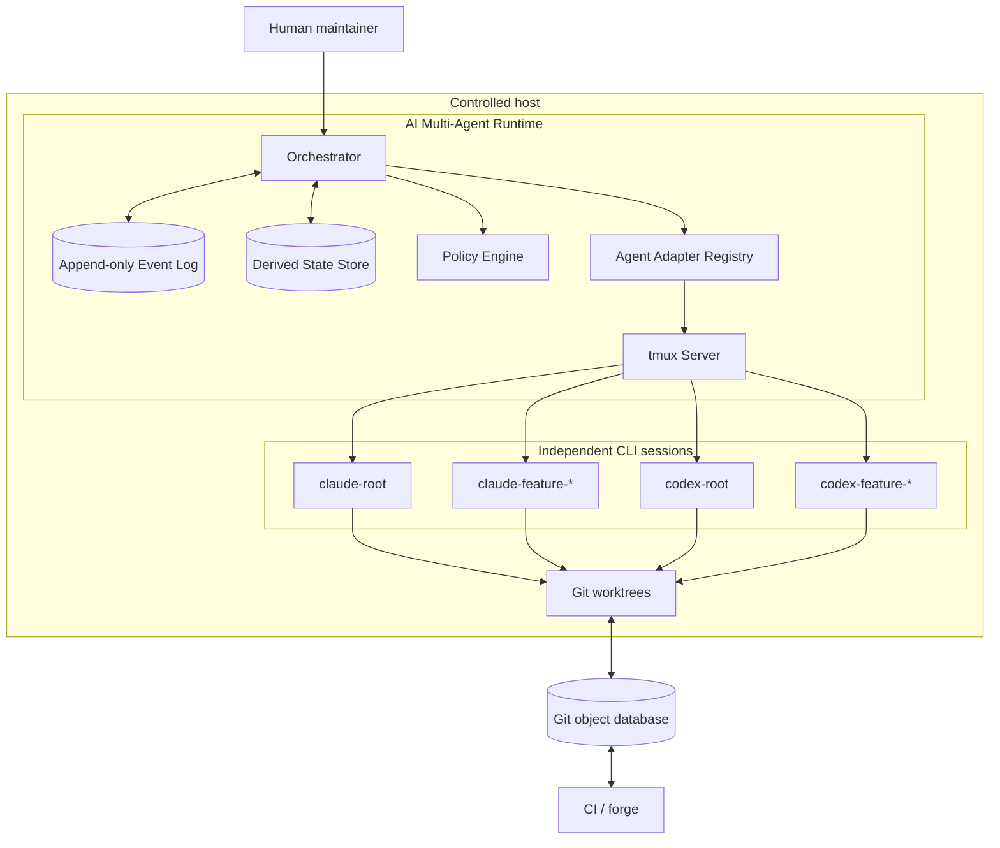
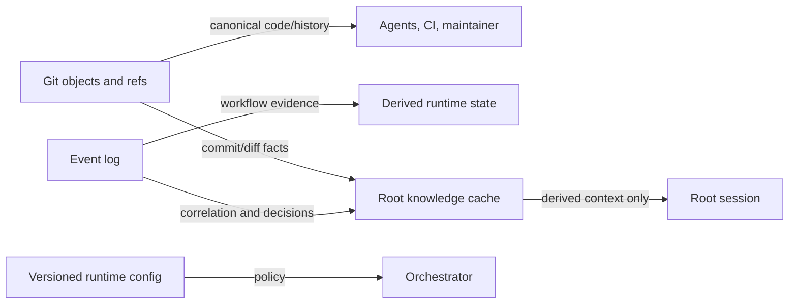

# 01 — Architecture Overview

## Purpose

This chapter defines the system boundary, principal components, durable state,
and architectural invariants of AI Multi-Agent Runtime. It is normative for the
local single-host v1 implementation.

The runtime coordinates agents; it does not become a source-control system,
code review system, or replacement for the agents it hosts. It provides an
execution model in which independent AI CLI processes can collaborate for long
periods while all durable software change remains auditable in Git.

## Why this architecture

Persistent CLI sessions offer useful continuity: a root agent can retain a
compact model of the repository, established conventions, and current
operational constraints. A monolithic persistent chat, however, has an
unbounded context footprint and blurs authority between planning, implementation
and approval. The architecture therefore combines persistence at the root with
disposal at the feature boundary.

The runtime chooses local files and `tmux` rather than a brokered RPC topology
because the initial target is one developer workstation or one controlled build
host. This choice keeps a failure inspectable with standard Unix tools and
makes agent terminals directly observable. It is not a claim that `tmux` is a
general distributed transport; the adapter boundary preserves a later path to a
queue or remote execution fabric.

## Scope and boundaries



The system boundary includes the orchestrator, agent adapters, runtime state
directory, worktree manager, and a `tmux` server under the runtime account. A
repository, its Git object database, external CI, CLI vendors, and the human
operator are external systems. The runtime may inspect or invoke those systems
but MUST NOT assert ownership of their internal state.

## Architectural invariants

| ID | Invariant | Enforcement point | Failure response |
| --- | --- | --- | --- |
| INV-01 | Git is the durable source of truth. | recovery and sync logic | reconstruct cache from Git. |
| INV-02 | Root sessions never write feature code. | capability policy | reject write lease. |
| INV-03 | A worktree has at most one writer. | worktree lease manager | deny conflicting lease. |
| INV-04 | Only Claude reviewer authority approves a merge in v1. | event authorization | reject event. |
| INV-05 | Knowledge synchronization occurs only after an integrated Git change. | sync precondition | defer or reject. |
| INV-06 | Normal execution does not use resume. | adapter state machine | report policy violation. |
| INV-07 | Event producers do not block on consumers. | orchestrator API | persist/route then return. |
| INV-08 | Feature sessions are disposable. | terminal cleanup flow | terminate and archive metadata. |
| INV-09 | Every state change has correlation and provenance. | event validator | reject incomplete event. |
| INV-10 | Raw prompts are not operational logs by default. | logging policy | redact or omit. |

An invariant violation is not merely a warning. The orchestrator MUST mark the
affected aggregate `blocked` or `failed`, retain the evidence, and require an
explicit recovery or operator action. It MUST NOT continue by silently granting
extra authority.

## Components and responsibilities

| Component | Responsibilities | Explicitly not responsible for |
| --- | --- | --- |
| Orchestrator | event routing, leases, state transitions, adapter calls, cleanup scheduling | judging code quality or inventing approval |
| Policy engine | capability evaluation, role mapping, protected-path rules | parsing untrusted terminal text as a decision |
| Adapter | start/fork/resume/stop a CLI, inject an event notice, collect bounded evidence | persisting global workflow state |
| Event log | immutable ordered records, delivery attempts, acknowledgements | mutable current state queries |
| State store | materialized aggregate state and indexes | independent business truth |
| Worktree manager | create, lease, inspect, remove feature worktrees | merging arbitrary branches |
| Git gateway | deterministic Git commands, commit and merge validation | long-lived session memory |
| Knowledge cache | compact derived project facts and pointers to commits | transcript archive or source of truth |
| Observability service | logs, metrics, traces, alerts | prompt or secret retention |

### Orchestrator

The orchestrator is a deterministic control plane. It accepts a proposed event,
validates its envelope and authorization, appends it durably, updates a
materialized aggregate, and schedules delivery to the intended actor. It MAY
run as a daemon, a supervised process, or an embedded service, but its durable
actions MUST be serializable and restart-safe.

It SHOULD keep intelligent language-model reasoning outside its trusted core.
The orchestrator can check that a review event contains required evidence and
that its sender has the Claude-review capability; it cannot infer that a free
form sentence means approval.

### Agent adapters

An adapter normalizes a CLI's commands and observable terminal behavior to the
runtime contract. The Claude and Codex adapters differ in launch commands,
fork syntax, resume identifiers, prompt injection details, and completion
signals. They MUST expose a common capability model rather than make the event
protocol vendor-specific.

Adapters are responsible for a narrow terminal boundary:

1. create or attach a named `tmux` session;
2. start the CLI in an assigned working directory;
3. send an event notification using `tmux send-keys`;
4. detect an adapter-defined readiness or terminal condition;
5. report bounded structured observations to the orchestrator;
6. never decide workflow progression from unvalidated prose alone.

### State and event stores

The event log is append-only and is the runtime's audit evidence. The state
store is a replaceable projection that makes current state cheap to inspect.
If the projection is deleted, the orchestrator MUST be able to rebuild it by
replaying validated events. If the log is deleted, Git and configuration can
still reconstruct repository truth but cannot reconstruct all workflow history;
that loss MUST be reported as an audit gap.

For v1, newline-delimited JSON files with atomic rename and a local lock are
acceptable. SQLite is recommended when multiple runtime processes inspect state
or when query and transactional requirements exceed simple files.

## Data ownership



| Data item | Owner | Durability | Reconstruction |
| --- | --- | --- | --- |
| application code, migration, generated source | Git | canonical | Git remote / object database |
| branch and integration ref | Git | canonical | Git remote / local refs |
| event envelope and acknowledgement | event log | operational audit | log backup; partial inference from Git |
| active lease | state store | ephemeral but durable while active | expire and reconcile |
| CLI resume ID | adapter state | best effort | optional; never required |
| root knowledge cache | root actor | derived | Git diff plus selected events |
| raw terminal transcript | local diagnostic store | optional/retained by policy | not required |
| metrics and logs | observability backend | operational | not required for correctness |

## Trust and execution zones

The design divides a host into five zones.

| Zone | Contents | Access rule |
| --- | --- | --- |
| Control | orchestrator, state, policy, adapter config | runtime account only |
| Root | root CLI sessions and read-only repository views | no code-write lease |
| Feature | feature session and assigned worktree | one active writer lease |
| Integration | protected checkout / integration worktree | merger capability only |
| External | network, forge, vendor APIs, MCP services | explicit adapter credentials and egress policy |

The same Unix user may host zones in the smallest deployment. Their logical
separation remains mandatory. Hardened deployments SHOULD use distinct Unix
accounts, filesystem ACLs, or containers for the feature and integration zones.

## Quality attributes

| Attribute | Target | Architectural mechanism | Trade-off |
| --- | --- | --- | --- |
| Durability | no source change lost on session failure | Git-first commits and worktrees | agent work between commits can be lost |
| Availability | unaffected agents keep working after peer failure | independent `tmux` sessions and events | more state coordination |
| Recoverability | function without resume IDs | derived cache and reconciliation | fresh sessions consume some tokens |
| Auditability | explain a merge and its approver | immutable events linked to commits | local log retention needed |
| Token efficiency | avoid replaying whole conversations | roots, forks, diff-scoped packets | cache can become stale |
| Safety | prevent unauthorized mutation/merge | capabilities and leases | additional rejection paths |
| Observability | diagnose stalled collaboration | structured logs/metrics | privacy controls required |

## Deployment topology

```mermaid
flowchart TB
    subgraph DeveloperHost[Developer host or dedicated runner]
      OD[Orchestrator daemon]
      TS[tmux server]
      RSD[.ai-runtime state directory]
      IW[Integration worktree]
      FW[Feature worktree(s)]
      OD --> TS
      OD --> RSD
      OD --> IW
      OD --> FW
    end
    Remote[(origin remote)]
    Forge[CI and branch protection]
    IW <--> Remote
    Remote <--> Forge
```

The host is a single failure domain in v1. A host reboot ends `tmux` processes,
but not Git history or state files stored on durable volume. Recovery therefore
reconciles the filesystem, Git, event log, and configuration before attempting
any optional CLI resume. Multi-host scheduling is a future extension because it
requires distributed leases, secure transport, and a durable shared event log.

## Key execution path

1. A human or policy emits `feature.requested` with a stable feature ID.
2. The orchestrator assigns a Claude planning feature session by asking the
   Claude root adapter to fork, creates a planning worktree if needed, and
   records the lifecycle transition.
3. Claude emits a structured plan. After approval, the orchestrator assigns a
   Codex feature session and exclusive writer lease on a feature worktree.
4. Codex implements, tests, commits, and emits `implementation.ready` with
   commit IDs and changed-path evidence.
5. Claude review receives a read-only review packet. It emits either
   `changes.requested` or `merge.approved`.
6. The merger validates approval, ancestry, checks, and protected-path policy,
   then performs the integration merge.
7. Root sessions receive `merge.completed`. Each root reads Git evidence and
   updates only its own derived knowledge cache.

No step requires the prior sender to stay active after emission. An agent that
dies after emitting a valid event does not invalidate work already recorded in
Git and the event log.

## Alternatives considered

### Central conversation broker

A central LLM conversation service could consolidate messages and summaries.
It was rejected for v1 because it encourages transcript-first recovery,
increases vendor coupling, complicates secret retention, and treats dialogue as
durable truth. The cache model preserves useful summaries without creating that
dependency.

### Direct agent-to-agent RPC

Synchronous RPC appears simpler for request/response planning and review. It
was rejected because terminal agents may be busy, crashed, rate-limited, or
awaiting human input. An event log tolerates those cases and supports explicit
timeouts, retry, and investigation.

### One shared worktree

A shared checkout avoids branch management but makes concurrent edits and
review visibility unsafe. Per-feature worktrees add disk use and cleanup work
but provide clear write ownership, reproducible review bases, and isolation.

### Restart every task

Launching a new CLI per request reduces process management. It loses root
continuity and repeatedly pays initialization and prompt costs. Persistent
roots plus disposable forks align with the intended long-running workflow.

## Limitations and future improvements

`tmux send-keys` is a terminal-control primitive, not an authenticated message
bus. The v1 protocol uses it only as the notification channel; authoritative
events remain in the local store. Pane parsing can be adapter-specific and
fragile, so adapters SHOULD favor explicit sentinel output or files rather than
natural-language screen scraping.

The baseline's two-agent role model is intentionally narrow. Future models may
add specialist agents, MCP workers, or separate human reviewers. Extensions
MUST still name one owner for each write lease, one approver for each merge,
and one root synchronizer per root cache.

See [Architectural Decisions](04-decision-records.md) for decision records and
[State Model and Diagrams](03-state-model-diagrams.md) for formal state
transitions.

