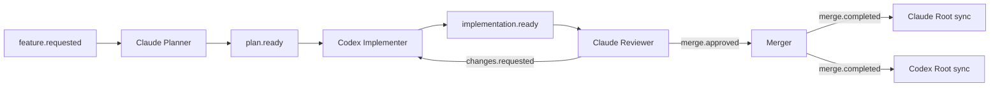

# 02 — Agent Model and Decision Records

## Purpose

This chapter specifies the agent roles, ownership boundaries, capabilities, and
baseline decision authority. It defines how Claude CLI and Codex CLI coexist
without making either a privileged, unaccountable operator.

## Why explicit roles

An AI CLI can plan, edit, test, review, and issue Git commands. Permitting every
process to do every action makes a successful change difficult to attribute and
an unsafe change difficult to prevent. Explicit roles make the collaboration
workflow inspectable: a plan has an author, code has a writer, a review has an
authority, and a merge has a deterministic gate.

Roles are logical capabilities, not proof that two sessions use distinct model
vendors. The baseline role profile assigns them to distinct Claude and Codex sessions to
reduce correlated mistakes and keep approval authority unambiguous.

## Role catalog

| Role | Session class | Primary responsibility | Writes application code? | Terminal condition |
| --- | --- | --- | --- | --- |
| Claude Root | persistent root | project model, planning guidance, post-merge sync | no | host shutdown / explicit disable |
| Codex Root | persistent root | project model, implementation guidance, post-merge sync | no | host shutdown / explicit disable |
| Claude Planner | forked feature | feature plan, acceptance criteria, risk assessment | no | plan accepted/abandoned |
| Codex Implementer | forked feature | isolated code, tests, commits, implementation evidence | yes, assigned worktree | review resolved/abandoned |
| Claude Reviewer | forked or bounded review context | review changes and approve/reject merge | no | approval/rejection final |
| Merger | deterministic runtime actor | validate policy and update integration branch | integration only | merge outcome recorded |
| Human Maintainer | external principal | start work, intervene, override under policy | policy-specific | n/a |

The designation **Claude Reviewer** is a role. It MAY be a fresh fork from
Claude Root or another short-lived Claude session, but it MUST NOT inherit an
implementation session transcript as its primary review context. It receives a
review packet containing the plan, base and head commits, diff, checks, and
relevant decisions.

## Baseline flow ownership

The planner does not approve its own plan for implementation unless the policy
profile explicitly grants that capability. The reviewer does not edit code.
The implementer does not merge. The root does not perform implementation.
These boundaries limit ambiguity more than they limit model capability.

## Capability matrix

| Capability | Claude Root | Codex Root | Claude Planner | Codex Implementer | Claude Reviewer | Merger | Human |
| --- | ---: | ---: | ---: | ---: | ---: | ---: | ---: |
| read repository | yes | yes | yes | yes | yes | required | policy |
| write Knowledge Cache | own only | own only | no | no | no | no | policy |
| create feature fork | own adapter | own adapter | no | own adapter | own adapter | no | yes |
| write feature worktree | no | no | no | assigned only | no | no | policy |
| commit feature branch | no | no | no | assigned only | no | no | policy |
| request review | no | no | yes | yes | no | no | yes |
| emit review finding | no | no | optional | no | yes | no | yes |
| approve merge | no | no | no | no | yes | validates only | override only |
| merge integration | no | no | no | no | no | yes | override policy |
| run root synchronization | own only | own only | no | no | no | no | no |
| alter policy | no | no | no | no | no | no | authorized only |

Capabilities are evaluated at event acceptance and again at side-effect
execution. Dual evaluation prevents an event accepted under stale state from
gaining authority after a lease expires or a role is disabled.

## Root session contract

Each enabled AI owns exactly one root session. A root is the persistent holder
of a compact project model: architecture, conventions, dependency graph,
domain terms, project rules, active baselines, and links to salient Git changes.
It SHOULD receive routine work notices but MUST remain idle unless assigned a
root-specific task.

A root MUST NOT:

- make application-source edits in a feature worktree;
- hold a feature writer lease;
- merge a branch;
- synchronize its cache from a conversational recap alone;
- replay every prior feature transcript after a merge;
- assume its cache is correct when Git contradicts it.

A root MAY inspect Git, run read-only analysis, generate a feature fork,
update its own derived cache, and emit structured planning or synchronization
events. Knowledge Cache content and update mechanics are specified in
[Fork, Knowledge, and Prompt Cache](../runtime/05-fork-knowledge-prompt-cache.md).

## Feature session contract

Feature sessions are temporary. A planner feature session begins from a root
fork and is bounded by a feature ID. An implementer feature session begins from
its own root fork once a plan is accepted. It owns no durable memory after
termination except Git changes, structured events, and authorized summaries.

The fork is important even when the adapter can create a new prompt with the
same text. It captures a bounded copy of the root's relevant context while
preventing feature detail from expanding root history. If an adapter lacks a
native `/fork`, it MAY implement an equivalent `fork_context` operation only
when it records that the result is a synthetic fork and follows the same
disposal and provenance contract.

## Session identity

Every session has independent identifiers:

| Identifier | Example | Scope | Durability |
| --- | --- | --- | --- |
| `agent_id` | `claude` | adapter/vendor role | configuration |
| `root_id` | `claude-root` | one persistent root | durable state |
| `feature_id` | `feat-2026-0042` | workflow aggregate | Event Store/Git refs |
| `session_id` | `ses_01…` | runtime-managed process instance | state store |
| `tmux_session` | `codex-feature-feat-2026-0042` | terminal process group | live host |
| `cli_resume_id` | vendor-specific | adapter optimization | best effort |
| `correlation_id` | UUID | one event chain | Event Store |
| `causation_id` | event UUID | direct predecessor | Event Store |

V2 also records a `parent_session_id` for fork and reconstruction lineage and
the `knowledge_snapshot_version` used to create a child. These fields are
provenance metadata only. They do not permit child-to-parent terminal access,
inherit a conversation cache, or grant a capability.

The runtime-generated `session_id` MUST NOT be replaced by a vendor resume ID.
An adapter can store one or more vendor IDs as opaque metadata, but never use
their absence as reason to block fresh reconstruction.

## Decision rights

### Planning

Claude Planner owns the initial plan proposal. A plan is a structured artifact
with scope, non-goals, affected paths, acceptance criteria, test strategy,
risk level, and requested permissions. The runtime records `plan.ready`; a
policy-defined approver authorizes implementation. The baseline permits Claude
review authority to approve low-risk plans or requires a human for configured
risk classes.

### Implementation

Codex Implementer owns code changes only within an active writer lease and
assigned worktree. It MUST commit coherent changes before requesting review.
Uncommitted changes are not review-ready evidence because recovery and review
cannot refer to a stable object.

### Review and approval

Claude Reviewer owns review findings and the `merge.approved` decision. An
approval MUST bind to an exact feature head commit, target integration commit,
plan version, check evidence, and policy revision. It is invalidated if the
feature head, integration base, or protected policy changes.

### Merge

The Merger owns mutation of the integration branch. Its power is intentionally
mechanical: verify a valid approval, checkout integration worktree, merge a
specific commit under a lock, run policy-required checks, and emit an outcome.
It MUST NOT create an approval or alter reviewed source to force a merge.

### Knowledge synchronization

After a successful merge, each root owns synchronization of its own cache. A
deployment MAY record the synchronized cache manifest as a metadata-only Git
commit on a dedicated runtime knowledge branch. This is the final **Root Update
Commit** in the workflow; it MUST NOT modify application code or replace the
already merged integration commit. If metadata commits are disabled, the same
checkpoint is represented by the immutable synchronization event and cache
digest. A root may produce different summaries because its cache represents its own
model, but both MUST link facts to the same integrated Git range. A root cannot
synchronize another root's cache, and a feature session cannot synchronize any
Knowledge Cache.

## Decision records

The following decisions establish the baseline profile. Full records are in
[Architectural Decisions](04-decision-records.md).

| ID | Decision | Reason | Principal consequence |
| --- | --- | --- | --- |
| ADR-001 | Git is canonical; sessions are cache. | recovery and auditability | cache may be discarded |
| ADR-002 | One persistent root per agent. | retain stable project model | roots require health management |
| ADR-003 | One disposable fork per feature role. | prevent context inflation | fork lifecycle needed |
| ADR-004 | Events, not RPC. | tolerate stalled CLIs | eventual visibility and retries |
| ADR-005 | Claude approves, Codex implements. | deterministic role separation | policy is model-specific in the baseline profile |
| ADR-006 | `tmux` is the local process boundary. | inspectable local operation | no distributed transport |
| ADR-007 | Worktree writer leases. | prevent edit collisions | cleanup and fencing required |

## Role transition rules

Role identity is immutable for a session instance. A session MAY gain a
short-lived capability only through a new runtime-issued lease, and it MUST
lose that capability when the lease expires, the feature reaches a terminal
state, or policy is reloaded with a denial. Changing `role` on an existing
session to bypass a workflow transition is prohibited.

## Session Lineage Graph

The runtime projects roots and their fork/reconstruction descendants as a
directed acyclic forest. Roots can have multiple feature children, including
concurrent children that have distinct feature IDs, worktrees, and leases. A
child always records parent root/session, fork type, snapshot version, and
terminal disposition. The graph supports diagnostics such as “which cache
version informed this reviewer?” It is not a session communication graph:
every handoff remains an Event Store event routed by the Dispatcher.

The runtime MAY use one CLI process to host a root and launch a fork command
inside it only where the CLI's semantics make that safe. The resulting child
MUST still have a distinct runtime session record, event identity, disposal
state, and worktree lease. A visual `tmux` pane is not itself sufficient proof
of role separation.

## Trade-offs

The role model introduces handoffs, which add latency compared with a single
agent editing and merging directly. The benefit is inspectable authority,
independent review context, and a clear recovery point. The runtime minimizes
unproductive handoff cost with compact event packets and persistent roots, not
by eliminating review.

Choosing Claude as the sole baseline-profile approver is a governance policy, not a technical
property. It simplifies enforcement and makes a misconfigured approval easy to
detect. It also creates a dependency on one adapter class. Future profiles may
allow two-person approval, a human approver, or another reviewer adapter if
they preserve a single explicit authorization rule per protected branch.

## Future improvements

Future work may add specialist roles such as security reviewer, migration
reviewer, test worker, or documentation worker. Each new role MUST declare
whether it can write a worktree, emit a gate decision, use network credentials,
or update a Knowledge Cache. Adding an agent type without adding those capabilities
to the policy matrix is non-conforming.

The design also leaves room for weighted review quorum. That extension must
solve approval invalidation, independent evidence, deterministic conflict
resolution, and human override auditing before it can replace the baseline
single-Claude approval rule.
